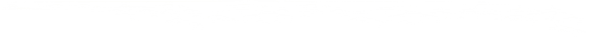

# Continuity

A Java state persistence/continuation/checkpointing library with runtime JVM state reification.

### Attribution

This implementation is based around OffByNull's Coroutines library <https://github.com/offbynull/coroutines>. I'm aiming
to attempt at providing support for lambdas via `INVOKEDYNAMIC` calls which are not supported in the coroutines library.

## Instrumentation Stages

* Method location
* Method introspection
* Serialization of .continuity files
* Bytecode injection
* Serialization data creation

## Stage 1: Method Location

Find methods to instrument in each ClassNode. Ignore classes that are interfaces since they possess no body or direct callsite.
Check if the class has already been instrumented, if it has, then ensure the marker is formatted correctly and then skip class 
if marker valid.

Find methods that have a Continuation instance passed as a parameter. Store these in the stage context and return;

## Stage 2: Method Introspection

Using the method instructions, find the call points for continuation and suspend points. Then Get method frames and
figure out what vars need to be allocated in order to store the LVA and OS stack vars. Also determine if there are
return values that need to be cached. Once these have been determined, allocate stack slots for them to be put into
during the bytecode injection stage. Next, create the variables for the Continuation parameter and the method state.

## Stage 3: Serialization of .continuity Files

TODO

## Stage 4: Bytecode Injection

See the `doc` directory for details on how state management bytecode is implemented and injected into the methods.

## Stage 5: Serialization Data Creation

## Continuity Lang

An intermediate language is used to create the bytecode definitions. The language is compiled into
Java, as a set of instructions loaded through `InsnBuilder`. All native functions in the `continuity`
language are direct static methods on `InsnBuilder`. Any function invocations that are from reference
chains such as `OSRestoreOperations.loadContainerVars(...)` are namespaced to invoke actual Java
classes.

This is not designed to be a full language, only a meta language as an intermediate transform. As such
the namespacing and available context is bound by a `HashMap` provided as context to the parser. Theoretically,
you can do anything you want in the language but it would require extensive modification of the parser
and additional context that would handle state in Java as opposed to the language.

Files are expected to use the `cibc` extension, indicating `Continuity Intermediate Bytecode`, an example
of this is the following:

```continuity
// File: example.cib
// Declare some vars that will be saturated with a HashMap context value. Can be anything.
in ctx;

/* Invoke some call and load a var from LVA */
call(in::ctx.setValue, load(in::ctx.contArgVar));
/**
 * Invoke an external context driven function via a reference chain,
 * the OSRestoreOperations reference is expected to be in the HashMap
 * provided as context to the parser.
 */
OSRestoreOperations.loadContainerVars(containerVar, "test", 12.34f);
```

Which generates the following parse tree:

